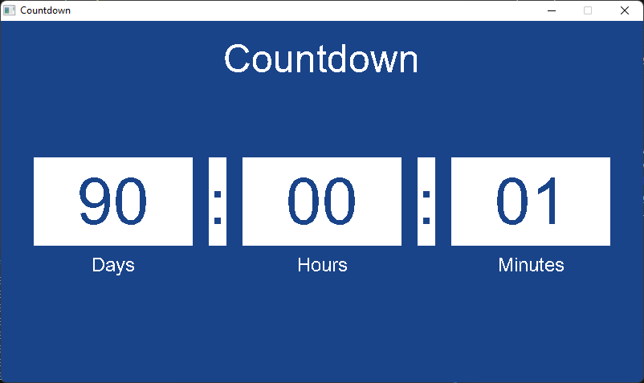

# SDL2 Countdown Timer

A simple countdown timer application built with SDL2 in C.

## Preview



## Setup and Build

1. Run `setup_sdl.ps1` to download and install SDL2, SDL2_image, and SDL2_ttf.
2. Compile the program using `compile_countdown.bat`.

## Usage

Run the compiled executable with a target date in YYYY-MM-DD format:

```bash
./countdown.exe YYYY-MM-DD
```

Example:

```bash
./countdown.exe 2024-12-31
```

Make sure `arial.ttf` is in the project directory or parent directory. 